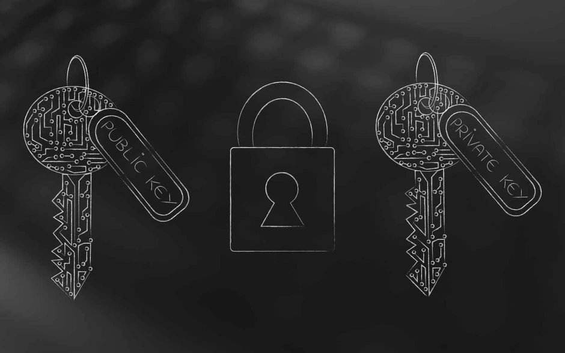

<div align="center">

# CryptoSuite


[](https://opensource.org/licenses/MIT)
[](https://github.com/sh4dowkey/CryptoSuite)
[](https://github.com/sh4dowkey/CryptoSuite)

</div>




> **CryptoSuite** — a lightweight, extensible cryptography toolkit written in **Python**. Designed for clarity and ease-of-use with a focus on modularity and learning.
> *Work in Progress — currently implements Base64 encode/decode.* 🚧

---

## ✨ Why CryptoSuite?

CryptoSuite is intended as a small, well-documented collection of cryptographic utilities for learning, experimentation, and lightweight tooling. The project aims to provide readable implementations, clear examples, and a friendly API so you (or contributors) can extend it with real cryptographic primitives and integrations.

## 🚧 Current Status

* **Repository status:** Work in Progress
* ✅ **Implemented:** Base64 encoding & decoding utilities (stable)
* ⛔ **Planned / TODO:** AES, hashing, HMAC, steganography, GUI/web UI, CLI polish

> See **Roadmap** below for details.

---

## 🛠️ Features

**Available now**

* `base64.encode()` — encode text/bytes to Base64
* `base64.decode()` — decode Base64 back to text/bytes

**Planned features**

* AES (CBC / GCM) symmetric encryption utilities
* SHA-family hashing helpers and HMAC wrappers
* Steganography helpers for images (PNG/JPEG) and audio
* Small GUI (Dark theme) and a simple web UI for quick demos
* CLI tool with subcommands and flags
* Tests, CI, documentation site

---

## 🚀 Quick Start

```bash
# Clone the repo
git clone https://github.com/sh4dowkey/CryptoSuite.git
cd CryptoSuite

# (Optional) create venv and activate
python -m venv .venv
# Windows
# .\.venv\Scripts\activate
# macOS / Linux
# source .venv/bin/activate

# Install (if dependencies added later)
pip install -r requirements.txt
```

*No external packages are required for the Base64 utilities included today — but keep `requirements.txt` for future additions.*

---

## 🧩 Usage Examples

### Import & use in Python

```python
from cryptosuite import base64

text = "Hello, CryptoSuite!"
encoded = base64.encode(text)
print(encoded)
# -> SGVsbG8sIENyeXB0b1N1aXRlIQ==

decoded = base64.decode(encoded)
print(decoded)
# -> Hello, CryptoSuite!
```

### CLI (future)

Planned CLI usage will be similar to:

```bash
# encode
cryptosuite base64 encode "some text"

# decode
cryptosuite base64 decode SGVsbG8=
```

---

## 🛣️ Roadmap

**v0.1** (current)

* Base64 encode/decode
* README, basic examples

**v0.2**

* Add AES (CBC/GCM) with proper IV handling
* Add unit tests & CI pipeline

**v0.3**

* Hashing / HMAC helpers
* CLI with subcommands

**v1.0**

* GUI / Web interface (dark theme by default)
* Steganography utilities
* Release & documentation site

---

## 🤝 Contributing

PRs, issues and improvements are welcome! If you'd like to contribute:

1. Fork the repo
2. Create a feature branch (`git checkout -b feat/my-feature`)
3. Add tests and documentation for your change
4. Open a Pull Request describing the change

Please follow these guidelines:

* Keep functions small and well-documented
* Add or update examples in the `examples/` folder
* Write unit tests for new behavior

---

## 📝 License

This project is released under the **MIT License**. See [LICENSE](LICENSE) for details.

---

## 🙏 Acknowledgements

Inspired by community cryptography resources and educational projects. If you find CryptoSuite useful, please ⭐ the repo and consider contributing!

---

